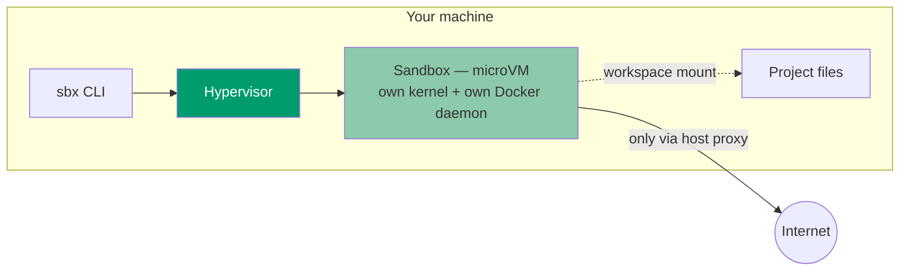
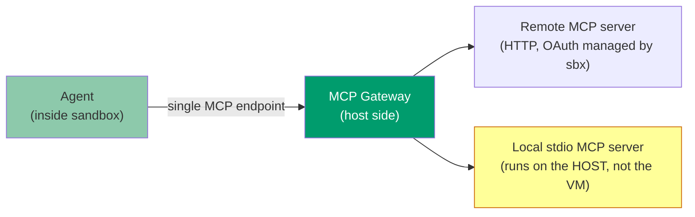
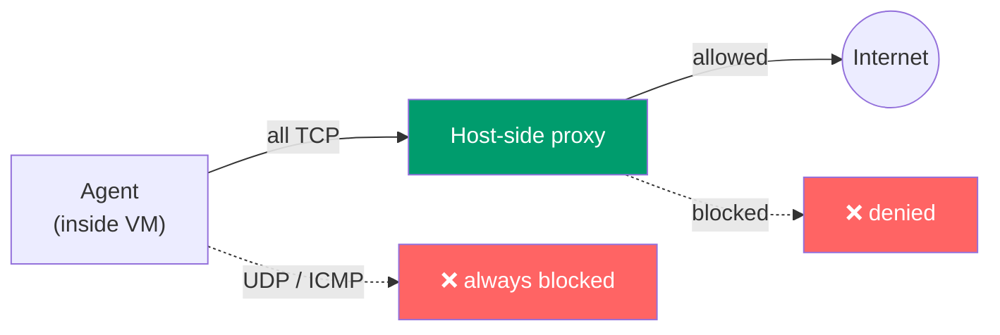

<div class="hero-background"></div>

<div class="hero-content">
  <h1 class="hero-title">Docker Sandboxes</h1>
  <h2 class="hero-subtitle">Letting AI Agents Off the Leash — Safely</h2>
  <p class="hero-description">A look at `sbx`</p>
</div>

<div class="pt-12">
  <span @click="$slidev.nav.next" class="px-4 py-2 rounded-lg cursor-pointer hero-button">
    Press Space for next page →
  </span>
</div>

<style>
@import url('https://fonts.googleapis.com/css2?family=Inter:wght@300;400;600;700;800&family=Fira+Code:wght@400;500&display=swap');

/* Global background for all pages */
html {
  background: linear-gradient(135deg, #f8f9fa 0%, #e9ecef 100%) !important;
}

html::after {
  content: '';
  position: fixed;
  top: 0;
  left: 0;
  right: 0;
  bottom: 0;
  background-image:
    radial-gradient(circle at 20% 30%, rgba(0, 156, 109, 0.04) 0%, transparent 50%),
    radial-gradient(circle at 80% 70%, rgba(0, 156, 109, 0.06) 0%, transparent 50%),
    linear-gradient(90deg, rgba(0, 156, 109, 0.015) 1px, transparent 1px),
    linear-gradient(rgba(0, 156, 109, 0.015) 1px, transparent 1px);
  background-size: 100% 100%, 100% 100%, 60px 60px, 60px 60px;
  pointer-events: none;
  z-index: 0;
}

body,
#slideshow,
.slidev-page,
.slidev-layout {
  background: transparent !important;
}

.hero-slide {
  position: relative;
}

.hero-background {
  position: absolute;
  top: 0;
  left: 0;
  right: 0;
  bottom: 0;
  background: linear-gradient(135deg, #009c6d 0%, #006b4d 100%);
  z-index: -1;
}

.hero-content {
  margin-top: 8rem;
  position: relative;
  z-index: 1;
}

.hero-title {
  font-family: 'Inter', sans-serif;
  font-size: 5rem;
  font-weight: 800;
  background: linear-gradient(135deg, #ffffff 0%, #f0f0f0 100%);
  -webkit-background-clip: text;
  -webkit-text-fill-color: transparent;
  background-clip: text;
  margin-bottom: 0.5rem;
  letter-spacing: -0.02em;
  filter: drop-shadow(0 2px 40px rgba(255, 255, 255, 0.3));
}

.hero-subtitle {
  font-family: 'Inter', sans-serif;
  font-size: 2rem;
  font-weight: 600;
  color: rgba(255, 255, 255, 0.9);
  margin-bottom: 1rem;
  letter-spacing: 0.02em;
}

.hero-description {
  font-family: 'Inter', sans-serif;
  font-size: 1.25rem;
  font-weight: 300;
  color: rgba(255, 255, 255, 0.7);
  letter-spacing: 0.03em;
}

.hero-button {
  background: rgba(255, 255, 255, 0.1);
  backdrop-filter: blur(10px);
  border: 1px solid rgba(255, 255, 255, 0.2);
  color: white;
  font-family: 'Inter', sans-serif;
  font-weight: 500;
  transition: all 0.3s ease;
  position: relative;
  z-index: 1;
}

.hero-button:hover {
  background: rgba(255, 255, 255, 0.2);
  transform: translateY(-2px);
  box-shadow: 0 8px 20px rgba(0, 0, 0, 0.2);
}
</style>

---
layout: center
class: text-center
---

# Agenda

<div class="grid grid-cols-2 gap-8 pt-8">

<div v-click>
  <div class="text-4xl mb-2">🤔</div>
  <div class="text-xl font-bold mb-2">Why Sandbox?</div>
  <div class="text-sm opacity-75">The YOLO dilemma</div>
  <div class="text-xs opacity-50">3 minutes</div>
</div>

<div v-click>
  <div class="text-4xl mb-2">🧩</div>
  <div class="text-xl font-bold mb-2">Core Concepts</div>
  <div class="text-sm opacity-75">Sandbox, template, kit, MCP gateway</div>
  <div class="text-xs opacity-50">10 minutes</div>
</div>

<div v-click>
  <div class="text-4xl mb-2">⚖️</div>
  <div class="text-xl font-bold mb-2">Trade-offs</div>
  <div class="text-sm opacity-75">Strengths & weaknesses</div>
  <div class="text-xs opacity-50">4 minutes</div>
</div>

<div v-click>
  <div class="text-4xl mb-2">🧭</div>
  <div class="text-xl font-bold mb-2">Verdict</div>
  <div class="text-sm opacity-75">Should we adopt it?</div>
  <div class="text-xs opacity-50">2 minutes</div>
</div>

</div>

---
layout: section
---

# Part 1: Why Sandbox an Agent?

The problem `sbx` is trying to solve

---

# The YOLO Dilemma

## Autonomous agents need autonomy — and autonomy is risky

<div class="grid grid-cols-2 gap-8 mt-4">

<div>

### What "autonomous" really means

<v-clicks>

- `--dangerously-skip-permissions` — no approval prompts
- The agent can read **any file** the host user can read
- The agent can run **any command** — `curl`, `rm`, `git push`
- A single `npm install` can trigger an arbitrary `postinstall` script
- Prompt injection from a fetched web page or a malicious MCP tool
  result can hijack the next action

</v-clicks>

</div>

<div>

<div v-click>

### The trade-off, before sandboxes

- **Supervise everything** → slow, defeats the point of an agent
- **Skip permissions** → fast, but the agent runs with *your* full
  privileges on *your* machine: `~/.ssh`, `~/.aws`, browser cookies,
  every other project's secrets

</div>

<div v-click class="mt-6 p-4 bg-green-600 bg-opacity-20 rounded">
<strong>Docker's pitch:</strong> give the agent a disposable, isolated
place to be reckless in — so speed and safety stop being a trade-off.
</div>

</div>

</div>

---
layout: section
---

# Part 2: Core Concepts

Sandbox · Template · Kit · MCP Gateway

---

# Concept 1 — Sandbox

## A disposable microVM, not a container

<div class="mt-6">



</div>

<div class="grid grid-cols-2 gap-8 mt-6 text-sm">

<div v-click>

**Five layers of isolation**
- Hypervisor — separate kernel, no shared memory/processes
- Network — all egress via a host-side proxy, deny-by-default
- Docker Engine — each sandbox gets its **own** Docker daemon
- Workspace — optional `--clone` for read-only host repos
- Credentials — secrets never enter the VM (more on this later)

</div>

<div v-click>

**The trust boundary is the VM itself**

> "The agent has full control inside the VM, including `sudo` access.
> The VM boundary prevents the agent from reaching anything on your
> host except what is explicitly shared."

Full hardware-level isolation — not namespaces, not seccomp profiles.

</div>

</div>

---

# The Workspace: Two Mount Modes

<div class="grid grid-cols-2 gap-8 mt-8">

<div v-click class="mode-card">
  <h3 class="text-lg font-bold mb-2">Direct mount</h3>
  <div class="mode-icon">📂</div>
  <p class="text-sm opacity-75 mb-2">virtiofs passthrough</p>
  <ul class="text-xs text-left">
    <li>Same absolute paths inside the VM</li>
    <li>Writes are <strong>live</strong> on your host, no sync delay</li>
    <li>Error messages / stack traces match your local files</li>
  </ul>
  <div class="mode-usage">Default mode</div>
</div>

<div v-click class="mode-card">
  <h3 class="text-lg font-bold mb-2">--clone</h3>
  <div class="mode-icon">🔒</div>
  <p class="text-sm opacity-75 mb-2">Read-only host repo</p>
  <ul class="text-xs text-left">
    <li>Host repo mounted <strong>read-only</strong></li>
    <li>Agent works on a private VM-side clone</li>
    <li>Nothing lands on the host until you merge back</li>
  </ul>
  <div class="mode-usage">Safer default for untrusted work</div>
</div>

</div>

<div v-click class="mt-8 p-4 bg-yellow-500 bg-opacity-20 rounded">
⚠️ <strong>Doc warning:</strong> don't use network-attached storage
(SMB/NFS shares, cloud-synced folders) as a workspace — every file
read/write would go over the network.
</div>

<style>
.mode-card {
  border: 2px solid #8dc9ab;
  border-radius: 8px;
  padding: 1rem;
  text-align: center;
}
.mode-icon {
  font-size: 3rem;
  margin: 0.5rem 0;
}
.mode-usage {
  margin-top: 1rem;
  padding-top: 0.5rem;
  border-top: 1px solid #8dc9ab;
  font-size: 0.75rem;
  font-weight: bold;
  opacity: 0.8;
}
</style>

---

# Concept 2 — Template

## A saved snapshot, not a raw Docker image

<div class="grid grid-cols-2 gap-8 mt-8">

<div>

<v-clicks>

- A template is a **snapshot of a whole sandbox**: filesystem state,
  installed packages, Docker image cache — frozen for reuse
- It sits *above* a base Docker image, not instead of one
- Built once ("install my toolchain, log in once"), reused to spin up
  new sandboxes in seconds instead of minutes

</v-clicks>

</div>

<div v-click>

```bash
# Save the current sandbox as a template
sbx template save my-team-stack

# List available templates
sbx template ls

# Spin up a fresh sandbox from a template
sbx run claude --template my-team-stack
```

<div class="mt-4 p-3 bg-green-600 bg-opacity-20 rounded text-sm">
Think "golden AMI" for agent sandboxes, not "Dockerfile".
</div>

</div>

</div>

---

# Concept 3 — Kits: Mixin vs. Sandbox

## Declarative YAML that extends or defines an agent environment

<div class="grid grid-cols-2 gap-8 mt-4">

<div v-click class="mode-card">
  <h3 class="text-lg font-bold mb-2">Mixin kit</h3>
  <div class="mode-icon">🧬</div>
  <p class="text-sm opacity-75 mb-2">Extends an existing agent</p>
  <ul class="text-xs text-left">
    <li><code>extends: claude</code></li>
    <li>Stackable — add several on top of one sandbox</li>
    <li>Install a linter, grant a credential, inject a team config</li>
  </ul>
</div>

<div v-click class="mode-card">
  <h3 class="text-lg font-bold mb-2">Sandbox kit</h3>
  <div class="mode-icon">📦</div>
  <p class="text-sm opacity-75 mb-2">Defines a whole agent</p>
  <ul class="text-xs text-left">
    <li>Own <code>sandbox:</code> block — image + entrypoint</li>
    <li>Ship a fully custom / internal agent</li>
    <li>Prototype a new agent integration from scratch</li>
  </ul>
</div>

</div>

<div v-click class="mt-6">

```yaml
# spec.yaml — mixin kit example
extends: claude
setup:
  install:
    - command: "pip install ruff"
environment:
  RUFF_CACHE_DIR: /tmp/ruff-cache
permissions:
  network:
    allow: [pypi.org]
agentInstructions: |
  Always run `ruff check` before finishing a task.
```

</div>

<div v-click class="mt-3 text-sm opacity-75">
Distributed as local paths, <code>git+https://</code> repos, or OCI
registries — and can be signed/verified with Sigstore
(<code>sbx kit sign</code> / <code>verify</code>).
</div>

---

# Concept 4 — MCP Gateway

## One endpoint for the agent, credentials stay on the host

<div class="mt-4">



</div>

<div class="grid grid-cols-2 gap-8 mt-6 text-sm">

<div v-click>

**What the gateway buys you**
- Agent only ever sees **one** MCP endpoint
- `sbx` manages server registration, OAuth tokens, and lifecycle
- Two modes: `static` (pre-loaded, restricted discovery) and
  `dynamic` (agent can `mcp-find` / `mcp-add` on its own)

</div>

<div v-click class="p-4 bg-yellow-500 bg-opacity-20 rounded">
⚠️ <strong>Honest caveat:</strong> local stdio MCP servers run on the
<strong>host</strong>, outside the sandbox's isolation boundary. Only
register commands you'd trust to run directly on your machine.
</div>

</div>

---

# Networking: Everything Goes Through One Proxy

<div class="mt-4">



</div>

<div class="grid grid-cols-2 gap-8 mt-6 text-sm">

<div v-click>

**TLS interception (MITM), by design**
- The proxy terminates HTTPS and re-encrypts with its own CA
- Lets it enforce policy *and* inject auth headers per-request
- Certificate pinning breaks this → escape hatch: `--bypass-host`
  tunnels that traffic uninspected

</div>

<div v-click>

**Credential injection**
- API keys/tokens are attached to outbound requests **by the proxy**
- Raw credential values **never enter the VM**
- Even a fully compromised agent can't exfiltrate the secret itself

</div>

</div>

---

# Network Policies

<div class="grid grid-cols-2 gap-8 mt-4">

<div>

### Three presets

<v-clicks>

- **Open** — everything allowed (dev convenience only)
- **Balanced** *(default)* — deny-by-default + baseline allowlist
  (AI provider APIs, package managers, code hosts, container registries)
- **Locked down** — deny everything, allow explicitly

</v-clicks>

<div v-click class="mt-4 text-sm">

**Rule syntax:** exact domain, `*.example.com` wildcard, port suffix
(`example.com:443`), CIDR ranges.

</div>

</div>

<div v-click>

```bash
sbx policy allow network api.anthropic.com
sbx policy allow network "*.googleapis.com"
sbx policy deny  network evil.example.com

sbx policy ls                 # active rules
sbx policy check network foo.com
sbx policy log                # audit trail
sbx policy reset              # back to defaults
```

</div>

</div>

---

# Audit Trail

## `sbx policy log`

<div class="mt-6">

| Host | Decision | Matched rule | Proxy | Requests |
|---|---|---|---|---|
| `api.anthropic.com` | ✅ allow | baseline allowlist | HTTPS | 214 |
| `registry.npmjs.org` | ✅ allow | baseline allowlist | HTTPS | 58 |
| `evil.example.com` | ❌ deny | local deny rule | HTTPS | 3 |
| `raw-socket:9001` | ❌ deny | UDP always blocked | TCP | 1 |

</div>

<div v-click class="mt-8 p-4 bg-green-600 bg-opacity-20 rounded">
One log gives a combined view of every sandbox's network activity —
whether the matching rule came from your local config or from
organization governance.
</div>

---

# Governance <span class="text-sm opacity-60">(paid tier)</span>

## Centralized policy for the whole org

<div class="grid grid-cols-2 gap-8 mt-4">

<div v-click>

**What admins control**
- Network access policies
- Filesystem access policies
- MCP server registration & tool policies (Cedar-based rules)

Applied org-wide or per team, from one place — instead of every
developer configuring their own machine.

</div>

<div v-click>

**How it lands**
- Propagates to developer machines within ~5 minutes
- Network policies: apply immediately to new requests
- Filesystem policies: apply to newly created sandboxes
- Under governance, **local `allow` rules are ignored** — only local
  `deny` rules still add extra restriction

</div>

</div>

<div v-click class="mt-6 p-4 bg-yellow-500 bg-opacity-20 rounded text-sm">
This is a separate paid subscription on top of Docker Sandboxes —
contact Docker Sales for org-wide enforcement.
</div>

---

# Hands-On

<div class="grid grid-cols-2 gap-8 mt-4">

<div>

### Install

```bash
# macOS (Apple silicon)
brew trust docker/tap && \
  brew install docker/tap/sbx

# Windows 11
winget install Docker.sbx

# Ubuntu 24.04+
curl -fsSL https://get.docker.com \
  | sudo REPO_ONLY=1 sh
sudo apt-get install docker-sbx
```

<div class="text-xs opacity-60 mt-2">No Docker Desktop or Docker Engine required.</div>

</div>

<div>

### Run

```bash
sbx login          # Docker OAuth in the browser
cd ~/my-project
sbx run claude      # or codex, opencode, kiro…
sbx ls               # list sandboxes
sbx rm <name>         # dispose of one
```

<div class="mt-4 text-xs opacity-75">
Requirements: macOS 14+ (Apple silicon) · Windows 11 + Hypervisor
Platform · Ubuntu 24.04+ with KVM enabled.
</div>

</div>

</div>

---
layout: section
---

# Part 3: Trade-offs

An honest assessment

---

# Strengths (1/2)

<div class="mt-1">

<div v-click class="strength-card">
  <div class="strength-icon">🛡️</div>
  <div class="strength-content">
    <h3>Hardware-Level Isolation</h3>
    <p>Hypervisor microVM, not namespaces or seccomp. A genuinely hard boundary between the agent and your host.</p>
  </div>
</div>

<div v-click class="strength-card">
  <div class="strength-icon">🔑</div>
  <div class="strength-content">
    <h3>Secrets Stay Outside the Sandbox</h3>
    <p>Credentials are injected into requests by the host proxy. Raw values never enter the VM the agent controls.</p>
  </div>
</div>

<div v-click class="strength-card">
  <div class="strength-icon">⚖️</div>
  <div class="strength-content">
    <h3>Not Judge and Party</h3>
    <p>The sandbox vendor isn't the agent vendor. Docker has no incentive to look the other way on what its agent does.</p>
  </div>
</div>

<div v-click class="strength-card">
  <div class="strength-icon">📜</div>
  <div class="strength-content">
    <h3>Built-In Audit Log</h3>
    <p><code>sbx policy log</code> gives a real record of every network decision an agent made — allow or deny.</p>
  </div>
</div>

</div>

<style>
.strength-card {
  display: flex;
  align-items: flex-start;
  padding: 0.6rem;
  margin-bottom: 0.6rem;
  background: rgba(100, 255, 100, 0.1);
  border-left: 4px solid #64ff64;
  border-radius: 4px;
}
.strength-icon {
  font-size: 1.6rem;
  margin-right: 0.7rem;
  min-width: 40px;
}
.strength-content h3 {
  font-size: 0.95rem;
  font-weight: bold;
  margin-bottom: 0.25rem;
}
.strength-content p {
  font-size: 0.8rem;
  opacity: 0.9;
  line-height: 1.25;
  margin-bottom: 0.6em;
}
</style>

---

# Strengths (2/2)

<div class="mt-1">

<div v-click class="strength-card">
  <div class="strength-icon">🗂️</div>
  <div class="strength-content">
    <h3>Per-Project Isolation</h3>
    <p>Disposable sandbox per repo, each with its own Docker daemon and image cache — no cross-project leakage.</p>
  </div>
</div>

<div v-click class="strength-card">
  <div class="strength-icon">🏢</div>
  <div class="strength-content">
    <h3>Centralized Governance</h3>
    <p>Org-wide network/filesystem/MCP policy from one place, propagated to every developer machine (paid tier).</p>
  </div>
</div>

<div v-click class="strength-card">
  <div class="strength-icon">🧑‍💻</div>
  <div class="strength-content">
    <h3>Docker's DX Expertise</h3>
    <p>This is Docker's home turf: packaging, distribution, and developer experience polish other tools lack.</p>
  </div>
</div>

<div v-click class="strength-card">
  <div class="strength-icon">🔮</div>
  <div class="strength-content">
    <h3>TLS Interception = Future Promise</h3>
    <p>Since the proxy already decrypts HTTPS, it has everything it needs to filter smarter — not just by host — later.</p>
  </div>
</div>

</div>

<style>
.strength-card {
  display: flex;
  align-items: flex-start;
  padding: 0.6rem;
  margin-bottom: 0.6rem;
  background: rgba(100, 255, 100, 0.1);
  border-left: 4px solid #64ff64;
  border-radius: 4px;
}
.strength-icon {
  font-size: 1.6rem;
  margin-right: 0.7rem;
  min-width: 40px;
}
.strength-content h3 {
  font-size: 0.95rem;
  font-weight: bold;
  margin-bottom: 0.25rem;
}
.strength-content p {
  font-size: 0.8rem;
  opacity: 0.9;
  line-height: 1.25;
  margin-bottom: 0.6em;
}
</style>

---

# Weaknesses

## What to watch out for

<div class="mt-1">

<div v-click class="weakness-card">
  <div class="weakness-icon">🔒</div>
  <div class="weakness-content">
    <h3>Not Open Source</h3>
    <p>Distributed as a binary via <code>docker/sbx-releases</code>. You get an issue tracker, not the source.</p>
  </div>
</div>

<div v-click class="weakness-card">
  <div class="weakness-icon">🌐</div>
  <div class="weakness-content">
    <h3>Requires Connectivity to docker.io</h3>
    <p><code>sbx login</code> is a mandatory Docker OAuth step. No fully offline / air-gapped usage.</p>
  </div>
</div>

<div v-click class="weakness-card">
  <div class="weakness-icon">🧩</div>
  <div class="weakness-content">
    <h3>Adds Real Complexity</h3>
    <p>A new layer, new concepts (sandbox/template/kit/gateway), and network issues that now need debugging through a proxy.</p>
  </div>
</div>

<div v-click class="weakness-card">
  <div class="weakness-icon">🕳️</div>
  <div class="weakness-content">
    <h3>Filtering Stops at the Domain (L4, not L7)</h3>
    <p>Rules match host and port, not URL paths. The proxy technically inspects HTTPS traffic, but policy doesn't yet act on it.</p>
  </div>
</div>

</div>

<style>
.weakness-card {
  display: flex;
  align-items: flex-start;
  padding: 0.6rem;
  margin-bottom: 0.6rem;
  background: rgba(255, 100, 100, 0.1);
  border-left: 4px solid #ff6464;
  border-radius: 4px;
}
.weakness-icon {
  font-size: 1.6rem;
  margin-right: 0.7rem;
  min-width: 40px;
}
.weakness-content h3 {
  font-size: 0.95rem;
  font-weight: bold;
  margin-bottom: 0.25rem;
}
.weakness-content p {
  font-size: 0.8rem;
  opacity: 0.9;
  line-height: 1.25;
  margin-bottom: 0.6em;
}
</style>

---
layout: center
class: text-center
---

# Verdict

<div class="grid grid-cols-3 gap-6 mt-8 text-left">

<div v-click class="verdict-card verdict-use">
  <h3 class="text-lg font-bold mb-2">✅ Use it</h3>
  <ul class="text-sm">
    <li>Running agents in YOLO / autonomous mode</li>
    <li>Non-trivial repos with real secrets nearby</li>
    <li>Regulated teams that need an audit trail</li>
  </ul>
</div>

<div v-click class="verdict-card verdict-maybe">
  <h3 class="text-lg font-bold mb-2">🤔 Maybe</h3>
  <ul class="text-sm">
    <li>Already working on an isolated / throwaway machine</li>
    <li>Occasional, supervised agent usage</li>
  </ul>
</div>

<div v-click class="verdict-card verdict-skip">
  <h3 class="text-lg font-bold mb-2">🚫 Skip</h3>
  <ul class="text-sm">
    <li>Hard requirement for fully open-source tooling</li>
    <li>Non-Apple-silicon Mac fleet</li>
    <li>Fully offline / air-gapped workflows</li>
  </ul>
</div>

</div>

<style>
.verdict-card {
  border-radius: 8px;
  padding: 1rem;
}
.verdict-use {
  background: rgba(100, 255, 100, 0.1);
  border-left: 4px solid #64ff64;
}
.verdict-maybe {
  background: rgba(255, 200, 100, 0.1);
  border-left: 4px solid #ffc864;
}
.verdict-skip {
  background: rgba(255, 100, 100, 0.1);
  border-left: 4px solid #ff6464;
}
</style>

---
layout: center
class: text-center
---

# Questions?

<div class="mt-12">

<div class="text-xl mb-8 opacity-75">
docs.docker.com/ai/sandboxes
</div>

<div class="grid grid-cols-3 gap-8 max-w-2xl mx-auto">

<div>
  <div class="text-3xl mb-2">📧</div>
  <div class="text-sm">Email</div>
</div>

<div>
  <div class="text-3xl mb-2">💬</div>
  <div class="text-sm">Chat</div>
</div>

<div>
  <div class="text-3xl mb-2">🔗</div>
  <div class="text-sm">Links</div>
</div>

</div>

</div>

---
layout: center
class: text-center
---

# Thank You!

<div class="mt-8 text-4xl">
🐳 + 🤖 = 🔒
</div>

<PoweredBySlidev mt-10 />

<!-- Global styles for all slides -->
<style global>
/* Override UnoCSS default white background */
html, body, #app, #page-root {
  background: linear-gradient(135deg, #f8f9fa 0%, #e9ecef 100%) !important;
}

/* Add subtle texture overlay */
body::after {
  content: '';
  position: fixed;
  top: 0;
  left: 0;
  right: 0;
  bottom: 0;
  background-image:
    radial-gradient(circle at 20% 30%, rgba(0, 156, 109, 0.04) 0%, transparent 50%),
    radial-gradient(circle at 80% 70%, rgba(0, 156, 109, 0.06) 0%, transparent 50%),
    linear-gradient(90deg, rgba(0, 156, 109, 0.015) 1px, transparent 1px),
    linear-gradient(rgba(0, 156, 109, 0.015) 1px, transparent 1px);
  background-size: 100% 100%, 100% 100%, 60px 60px, 60px 60px;
  pointer-events: none;
  z-index: 0;
}

/* Keep slideshow content above overlay */
#slideshow {
  position: relative;
  z-index: 1;
}

/* Make slides transparent to show background */
.slidev-page:not(.slidev-page-1),
.slidev-page:not(.slidev-page-1) .slidev-layout {
  background: transparent !important;
}
</style>
