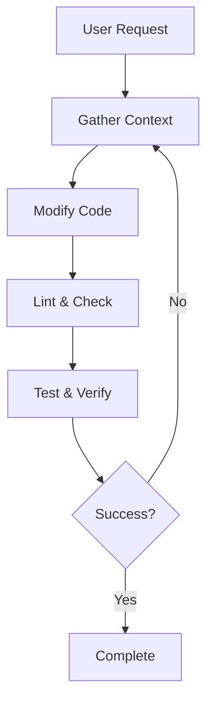
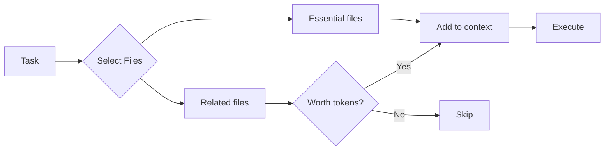
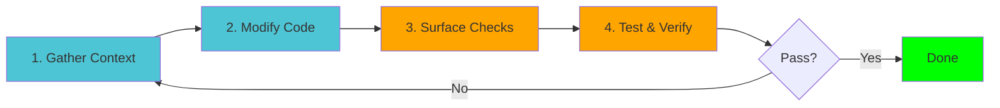

# Claude Code

## Experience Feedback

A journey through AI-powered development

<div class="pt-12">
  <span @click="$slidev.nav.next" class="px-2 py-1 rounded cursor-pointer" hover:bg="white op-10">
    Press Space for next page <carbon:arrow-right class="inline"/>
  </span>
</div>

---
layout: center
class: text-center
---

# Agenda

<div class="grid grid-cols-2 gap-8 pt-8">

<div v-click>
  <div class="text-4xl mb-2">📜</div>
  <div class="text-xl font-bold mb-2">History</div>
  <div class="text-sm opacity-75">Evolution of AI coding tools</div>
  <div class="text-xs opacity-50">2 minutes</div>
</div>

<div v-click>
  <div class="text-4xl mb-2">🔧</div>
  <div class="text-xl font-bold mb-2">Claude Code</div>
  <div class="text-sm opacity-75">Features & workflow</div>
  <div class="text-xs opacity-50">12 minutes</div>
</div>

<div v-click>
  <div class="text-4xl mb-2">⚖️</div>
  <div class="text-xl font-bold mb-2">Trade-offs</div>
  <div class="text-sm opacity-75">Strengths & weaknesses</div>
  <div class="text-xs opacity-50">3 minutes</div>
</div>

<div v-click>
  <div class="text-4xl mb-2">💭</div>
  <div class="text-xl font-bold mb-2">Opinion</div>
  <div class="text-sm opacity-75">Lessons learned</div>
  <div class="text-xs opacity-50">3 minutes</div>
</div>

</div>

---
layout: section
---

# Part 1: History of AI Coding Tools

The evolution from copy-paste to agentic coding

---
transition: slide-up
---

# The Three Eras of AI Coding

<div class="timeline mt-8">

<div v-click class="timeline-item">
  <div class="timeline-marker">2022</div>
  <div class="timeline-content">
    <h3 class="text-xl font-bold">ChatGPT Era</h3>
    <p class="text-sm opacity-75">Disconnected from IDE</p>
    <ul class="text-sm mt-2">
      <li>Copy-paste workflow</li>
      <li>Manual integration</li>
      <li>Context switching</li>
    </ul>
  </div>
</div>

<div v-click class="timeline-item">
  <div class="timeline-marker">2023</div>
  <div class="timeline-content">
    <h3 class="text-xl font-bold">GitHub Copilot Era</h3>
    <p class="text-sm opacity-75">IDE Integration</p>
    <ul class="text-sm mt-2">
      <li>Autocomplete-style assistance</li>
      <li>In-editor suggestions</li>
      <li>Context-aware completions</li>
    </ul>
  </div>
</div>

<div v-click class="timeline-item">
  <div class="timeline-marker">2024</div>
  <div class="timeline-content">
    <h3 class="text-xl font-bold">Agentic Coding Era</h3>
    <p class="text-sm opacity-75">Active collaboration</p>
    <ul class="text-sm mt-2">
      <li>Multi-file editing</li>
      <li>Command execution</li>
      <li>Codebase analysis</li>
      <li>Iterative refinement</li>
    </ul>
  </div>
</div>

</div>

<style>
.timeline-item {
  display: flex;
  margin-bottom: 2rem;
  align-items: flex-start;
}
.timeline-marker {
  min-width: 80px;
  font-weight: bold;
  color: #4EC5D4;
  font-size: 1.1rem;
}
.timeline-content {
  flex: 1;
  padding-left: 2rem;
  border-left: 2px solid #4EC5D4;
}
</style>

---
layout: section
---

# Part 2: Claude Code

Deep dive into features and workflow

---
transition: fade
---

# What is Claude Code?

<div class="grid grid-cols-2 gap-8 mt-8">

<div>

## Key Features

<v-clicks>

- 🧠 **Agentic AI** - Autonomous task execution
- 📁 **Multi-file editing** - Comprehensive codebase changes
- 🔍 **Context management** - Smart file selection
- ⚡ **Command execution** - Run tests, build, deploy
- 🔄 **Iterative workflow** - Continuous refinement
- 🔌 **MCP modules** - Extensible integrations

</v-clicks>

</div>

<div v-click>

## How it Works



</div>

</div>

---

# Memory Files

## Controlling Claude Code's behavior

<div class="grid grid-cols-2 gap-8 mt-4">

<div>

### CLAUDE.md

Project-specific instructions and context

```markdown
# My Project

## Overview
This is a React + TypeScript project...

## Code Standards
- Use functional components
- Prefer const over let
- Write tests for all features

## Architecture
- /src/components - React components
- /src/utils - Utility functions
```

<v-click>

**Purpose:** Guide Claude's understanding and decisions

</v-click>

</div>

<div>

### .claudeignore

Exclude files from context

```bash
# Dependencies
node_modules/
dist/
build/

# Large files
*.log
*.mp4
*.zip

# Secrets
.env
credentials.json
```

<v-click>

**Purpose:** Save tokens and protect sensitive data

</v-click>

</div>

</div>

---

# Demo: Memory Files in Action

<div class="flex items-center justify-center" style="height: 400px;">

<!-- Video placeholder -->
<div class="video-placeholder">
  <video controls width="800" src="/videos/demo-memory-files.mp4">
    Your browser does not support the video tag.
  </video>
  <div class="video-fallback">
    📹 Video: Demonstrating CLAUDE.md and .claudeignore usage
  </div>
</div>

</div>

<style>
.video-placeholder {
  position: relative;
  background: #1a1a1a;
  border-radius: 8px;
  overflow: hidden;
}
.video-fallback {
  position: absolute;
  top: 50%;
  left: 50%;
  transform: translate(-50%, -50%);
  text-align: center;
  opacity: 0.5;
  pointer-events: none;
}
video + .video-fallback {
  display: none;
}
</style>

---

# The Three Modes

Different workflows for different needs

<div class="grid grid-cols-3 gap-4 mt-8">

<div v-click class="mode-card">
  <h3 class="text-lg font-bold mb-2">Default Mode</h3>
  <div class="mode-icon">🤔</div>
  <p class="text-sm opacity-75 mb-2">Review before applying</p>
  <ul class="text-xs">
    <li>✓ Full control</li>
    <li>✓ See changes first</li>
    <li>✓ Best for critical code</li>
  </ul>
  <div class="mode-usage">Use: 80% of the time</div>
</div>

<div v-click class="mode-card">
  <h3 class="text-lg font-bold mb-2">Accept Edits On</h3>
  <div class="mode-icon">⚡</div>
  <p class="text-sm opacity-75 mb-2">Auto-apply changes</p>
  <ul class="text-xs">
    <li>✓ Fast iteration</li>
    <li>✓ "Vibe coding"</li>
    <li>⚠️ Less oversight</li>
  </ul>
  <div class="mode-usage">Use: Quick experiments</div>
</div>

<div v-click class="mode-card">
  <h3 class="text-lg font-bold mb-2">Plan Mode On</h3>
  <div class="mode-icon">📋</div>
  <p class="text-sm opacity-75 mb-2">Plan before executing</p>
  <ul class="text-xs">
    <li>✓ See strategy first</li>
    <li>✓ Approve plan</li>
    <li>✓ Complex tasks</li>
  </ul>
  <div class="mode-usage">Use: Large refactors</div>
</div>

</div>

<style>
.mode-card {
  border: 2px solid #4EC5D4;
  border-radius: 8px;
  padding: 1rem;
  text-align: center;
}
.mode-icon {
  font-size: 3rem;
  margin: 0.5rem 0;
}
.mode-usage {
  margin-top: 1rem;
  padding-top: 0.5rem;
  border-top: 1px solid #4EC5D4;
  font-size: 0.75rem;
  font-weight: bold;
  opacity: 0.8;
}
</style>

---

# Demo: Mode Switching

<div class="flex items-center justify-center" style="height: 450px;">

<div class="video-placeholder">
  <video controls width="900" src="/videos/demo-modes.mp4">
    Your browser does not support the video tag.
  </video>
  <div class="video-fallback">
    📹 Video: Switching between Default, Accept Edits, and Plan modes
  </div>
</div>

</div>

---

# Context Management

## The key to success

<div class="grid grid-cols-2 gap-8 mt-4">

<div>

### Why Context Matters

<v-clicks>

- **Token limits** - Claude has a maximum context window
- **Quality** - More relevant context = better results
- **Cost** - Tokens = money
- **Speed** - Less context = faster responses

</v-clicks>

<div v-click class="mt-4 p-4 bg-blue-500 bg-opacity-20 rounded">
<strong>Key insight:</strong> Context is often the limiting factor in AI coding
</div>

</div>

<div v-click>

### Strategies



**Best practices:**
- Use `.claudeignore` aggressively
- Only include relevant files
- Remove files when done
- Use CLAUDE.md for permanent context

</div>

</div>

---

# Demo: Context Management

<div class="flex items-center justify-center" style="height: 450px;">

<div class="video-placeholder">
  <video controls width="900" src="/videos/demo-context.mp4">
    Your browser does not support the video tag.
  </video>
  <div class="video-fallback">
    📹 Video: Managing context effectively - adding/removing files, using .claudeignore
  </div>
</div>

</div>

---

# The Micro-Iteration Workflow

## How Claude Code works internally

<div class="mt-8">



</div>

<div class="grid grid-cols-5 gap-2 mt-8 text-sm">

<div v-click>
<strong>1. Gather</strong>
<ul class="text-xs mt-1">
  <li>Read files</li>
  <li>Search code</li>
  <li>Analyze structure</li>
</ul>
</div>

<div v-click>
<strong>2. Modify</strong>
<ul class="text-xs mt-1">
  <li>Edit files</li>
  <li>Create new code</li>
  <li>Refactor</li>
</ul>
</div>

<div v-click>
<strong>3. Check</strong>
<ul class="text-xs mt-1">
  <li>Run linter</li>
  <li>Type check</li>
  <li>Format code</li>
</ul>
</div>

<div v-click>
<strong>4. Verify</strong>
<ul class="text-xs mt-1">
  <li>Run tests</li>
  <li>Build project</li>
  <li>Check output</li>
</ul>
</div>

<div v-click>
<strong>5. Loop</strong>
<ul class="text-xs mt-1">
  <li>Fix errors</li>
  <li>Refine code</li>
  <li>Iterate</li>
</ul>
</div>

</div>

<div v-click class="mt-6 p-4 bg-yellow-500 bg-opacity-20 rounded">
💡 <strong>Pro tip:</strong> This is why tests are crucial - they enable faster iteration without burning tokens
</div>

---

# Demo: Micro-Iterations in Practice

<div class="flex items-center justify-center" style="height: 450px;">

<div class="video-placeholder">
  <video controls width="900" src="/videos/demo-iterations.mp4">
    Your browser does not support the video tag.
  </video>
  <div class="video-fallback">
    📹 Video: Watching Claude Code iterate on a feature - gather, modify, test, loop
  </div>
</div>

</div>

---

# MCP Modules

## Model Context Protocol

<div class="grid grid-cols-2 gap-8 mt-4">

<div>

### What is MCP?

<v-clicks>

- **Extension system** for Claude Code
- **Standardized protocol** for integrations
- **Custom tools** and data sources
- **Community-driven** ecosystem

</v-clicks>

<div v-click class="mt-4">

**Popular MCP Servers:**
- `@modelcontextprotocol/server-filesystem` - File access
- `@modelcontextprotocol/server-github` - GitHub integration
- `@modelcontextprotocol/server-postgres` - Database queries
- Custom servers for APIs, services, etc.

</div>

</div>

<div v-click>

### Example Configuration

```json
{
  "mcpServers": {
    "filesystem": {
      "command": "npx",
      "args": [
        "-y",
        "@modelcontextprotocol/server-filesystem",
        "/path/to/allowed/files"
      ]
    },
    "github": {
      "command": "npx",
      "args": [
        "-y",
        "@modelcontextprotocol/server-github"
      ],
      "env": {
        "GITHUB_TOKEN": "your-token"
      }
    }
  }
}
```

</div>

</div>

---

# Demo: MCP Modules

<div class="flex items-center justify-center" style="height: 450px;">

<div class="video-placeholder">
  <video controls width="900" src="/videos/demo-mcp.mp4">
    Your browser does not support the video tag.
  </video>
  <div class="video-fallback">
    📹 Video: Using MCP modules to integrate external tools and services
  </div>
</div>

</div>

---
layout: section
---

# Part 3: Strengths & Weaknesses

An honest assessment

---

# Weaknesses

## What to watch out for

<div class="mt-4">

<div v-click class="weakness-card">
  <div class="weakness-icon">🎭</div>
  <div class="weakness-content">
    <h3>Hallucinations Still Exist</h3>
    <p>Claude can confidently generate incorrect code. Iterations help, but verification is essential.</p>
  </div>
</div>

<div v-click class="weakness-card">
  <div class="weakness-icon">🚀</div>
  <div class="weakness-content">
    <h3>Often Too Enterprising</h3>
    <p>Claude tends to over-engineer solutions. You need to rein it in and ask for simpler approaches.</p>
  </div>
</div>

<div v-click class="weakness-card">
  <div class="weakness-icon">😴</div>
  <div class="weakness-content">
    <h3>Developer Risks</h3>
    <ul>
      <li><strong>Laziness:</strong> Becoming too dependent on AI</li>
      <li><strong>Overconfidence:</strong> Trusting AI without verification</li>
      <li><strong>Over-ambition:</strong> Starting too many things, mental overload</li>
    </ul>
  </div>
</div>

</div>

<style>
.weakness-card {
  display: flex;
  align-items: flex-start;
  padding: 1rem;
  margin-bottom: 1rem;
  background: rgba(255, 100, 100, 0.1);
  border-left: 4px solid #ff6464;
  border-radius: 4px;
}
.weakness-icon {
  font-size: 2rem;
  margin-right: 1rem;
  min-width: 50px;
}
.weakness-content h3 {
  font-size: 1.1rem;
  font-weight: bold;
  margin-bottom: 0.5rem;
}
.weakness-content p, .weakness-content ul {
  font-size: 0.9rem;
  opacity: 0.9;
}
</style>

---

# Strengths

## Why it's worth using

<div class="mt-4">

<div v-click class="strength-card">
  <div class="strength-icon">⚡</div>
  <div class="strength-content">
    <h3>Speed of Implementation</h3>
    <p>What used to take hours can now take minutes. Rapid prototyping and feature development.</p>
  </div>
</div>

<div v-click class="strength-card">
  <div class="strength-icon">✍️</div>
  <div class="strength-content">
    <h3>Quality of Writing</h3>
    <p>Like human language, code might hallucinate, but it's well-written. Clean, readable, idiomatic.</p>
  </div>
</div>

<div v-click class="strength-card">
  <div class="strength-icon">🧪</div>
  <div class="strength-content">
    <h3>Free Code / POCs</h3>
    <p>Claude readily creates proof-of-concepts to validate ideas before committing to full implementation.</p>
  </div>
</div>

<div v-click class="strength-card">
  <div class="strength-icon">🔍</div>
  <div class="strength-content">
    <h3>Powerful Research</h3>
    <p>Less time on Google/Stack Overflow. Claude can search, understand, and synthesize information quickly.</p>
  </div>
</div>

<div v-click class="strength-card">
  <div class="strength-icon">🚀</div>
  <div class="strength-content">
    <h3>Enables Ambition</h3>
    <p>Build features you might not have attempted before. (But watch for tech debt!)</p>
  </div>
</div>

</div>

<style>
.strength-card {
  display: flex;
  align-items: flex-start;
  padding: 0.8rem;
  margin-bottom: 0.8rem;
  background: rgba(100, 255, 100, 0.1);
  border-left: 4px solid #64ff64;
  border-radius: 4px;
}
.strength-icon {
  font-size: 1.8rem;
  margin-right: 1rem;
  min-width: 45px;
}
.strength-content h3 {
  font-size: 1rem;
  font-weight: bold;
  margin-bottom: 0.3rem;
}
.strength-content p {
  font-size: 0.85rem;
  opacity: 0.9;
}
</style>

---
layout: section
---

# Part 4: Personal Opinion

Lessons learned from real usage

---

# Disclaimer

<div class="text-center mt-12">

<div class="text-6xl mb-4">⚠️</div>

<div class="text-2xl font-bold mb-4">
My experience is based on small codebases
</div>

<div class="text-lg opacity-75">
Your mileage may vary with larger, more complex projects
</div>

</div>

---

# Key Insights

<div class="mt-4">

<div v-click class="insight-card">
  <div class="insight-number">1</div>
  <div class="insight-content">
    <h3>Context is Central</h3>
    <p>Context is often the limiting factor. Not the AI's capability, but what it can "see" at once.</p>
  </div>
</div>

<div v-click class="insight-card">
  <div class="insight-number">2</div>
  <div class="insight-content">
    <h3>The "Vibe Coding" Trap</h3>
    <p>I started with auto-accept mode, moving fast. Had to stop because internal design was poor, even though it "worked."</p>
  </div>
</div>

<div v-click class="insight-card">
  <div class="insight-number">3</div>
  <div class="insight-content">
    <h3>Tests Are Crucial</h3>
    <p>Good tests enable rapid iteration without consuming excessive tokens. They're your safety net.</p>
  </div>
</div>

<div v-click class="insight-card">
  <div class="insight-number">4</div>
  <div class="insight-content">
    <h3>Like Pair Programming</h3>
    <p>It feels like pair programming with a non-human partner. Be careful - same risks apply.</p>
  </div>
</div>

<div v-click class="insight-card">
  <div class="insight-number">5</div>
  <div class="insight-content">
    <h3>Hard to Go Back</h3>
    <p>Once you've experienced this workflow, returning to traditional development feels slow and tedious.</p>
  </div>
</div>

</div>

<style>
.insight-card {
  display: flex;
  align-items: flex-start;
  padding: 1rem;
  margin-bottom: 0.8rem;
  background: rgba(78, 197, 212, 0.1);
  border-left: 4px solid #4EC5D4;
  border-radius: 4px;
}
.insight-number {
  font-size: 2rem;
  font-weight: bold;
  color: #4EC5D4;
  margin-right: 1rem;
  min-width: 50px;
}
.insight-content h3 {
  font-size: 1.1rem;
  font-weight: bold;
  margin-bottom: 0.3rem;
}
.insight-content p {
  font-size: 0.9rem;
  opacity: 0.9;
}
</style>

---
layout: center
class: text-center
---

# Final Thoughts

<div class="mt-8 text-xl leading-relaxed max-w-3xl mx-auto">

<div v-click class="mb-6">
Claude Code is <span class="text-green-400 font-bold">powerful</span>, but not <span class="text-red-400 font-bold">magic</span>.
</div>

<div v-click class="mb-6">
It's a <span class="text-blue-400 font-bold">tool</span> that amplifies your abilities,<br/>
but you still need to be a <span class="text-purple-400 font-bold">good developer</span>.
</div>

<div v-click class="mb-6">
Use it <span class="text-yellow-400 font-bold">wisely</span>, verify everything,<br/>
and keep learning.
</div>

<div v-click class="text-2xl font-bold mt-12">
The future of coding is <span class="text-gradient">collaborative</span>.
</div>

</div>

<style>
.text-gradient {
  background: linear-gradient(45deg, #4EC5D4, #146b8c);
  -webkit-background-clip: text;
  -webkit-text-fill-color: transparent;
  background-clip: text;
}
</style>

---
layout: center
class: text-center
---

# Questions?

<div class="mt-12">

<div class="text-xl mb-8 opacity-75">
This presentation was built WITH Claude Code
</div>

<div class="grid grid-cols-3 gap-8 max-w-2xl mx-auto">

<div>
  <div class="text-3xl mb-2">📧</div>
  <div class="text-sm">Email</div>
</div>

<div>
  <div class="text-3xl mb-2">💬</div>
  <div class="text-sm">Chat</div>
</div>

<div>
  <div class="text-3xl mb-2">🔗</div>
  <div class="text-sm">Links</div>
</div>

</div>

</div>

---
layout: center
class: text-center
---

# Thank You!

<div class="mt-8 text-4xl">
🤖 + 👨‍💻 = 🚀
</div>

<PoweredBySlidev mt-10 />
