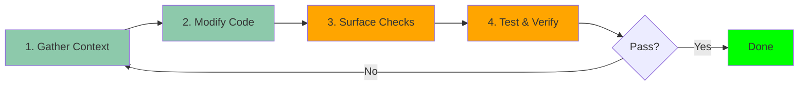

<div class="hero-background"></div>

<div class="hero-content">
  <h1 class="hero-title">Claude Code</h1>
  <h2 class="hero-subtitle">Experience Feedback</h2>
  <p class="hero-description">A journey through AI-powered development</p>
</div>

<div class="pt-12">
  <span @click="$slidev.nav.next" class="px-4 py-2 rounded-lg cursor-pointer hero-button">
    Press Space for next page <carbon:arrow-right class="inline"/>
  </span>
</div>

<style>
@import url('https://fonts.googleapis.com/css2?family=Inter:wght@300;400;600;700;800&family=Fira+Code:wght@400;500&display=swap');

/* Global background for all pages */
html {
  background: linear-gradient(135deg, #f8f9fa 0%, #e9ecef 100%) !important;
}

html::after {
  content: '';
  position: fixed;
  top: 0;
  left: 0;
  right: 0;
  bottom: 0;
  background-image:
    radial-gradient(circle at 20% 30%, rgba(0, 156, 109, 0.04) 0%, transparent 50%),
    radial-gradient(circle at 80% 70%, rgba(0, 156, 109, 0.06) 0%, transparent 50%),
    linear-gradient(90deg, rgba(0, 156, 109, 0.015) 1px, transparent 1px),
    linear-gradient(rgba(0, 156, 109, 0.015) 1px, transparent 1px);
  background-size: 100% 100%, 100% 100%, 60px 60px, 60px 60px;
  pointer-events: none;
  z-index: 0;
}

body,
#slideshow,
.slidev-page,
.slidev-layout {
  background: transparent !important;
}

.hero-slide {
  position: relative;
}

.hero-background {
  position: absolute;
  top: 0;
  left: 0;
  right: 0;
  bottom: 0;
  background: linear-gradient(135deg, #009c6d 0%, #006b4d 100%);
  z-index: -1;
}

.hero-content {
  margin-top: 8rem;
  position: relative;
  z-index: 1;
}

.hero-title {
  font-family: 'Inter', sans-serif;
  font-size: 5rem;
  font-weight: 800;
  background: linear-gradient(135deg, #ffffff 0%, #f0f0f0 100%);
  -webkit-background-clip: text;
  -webkit-text-fill-color: transparent;
  background-clip: text;
  margin-bottom: 0.5rem;
  letter-spacing: -0.02em;
  filter: drop-shadow(0 2px 40px rgba(255, 255, 255, 0.3));
}

.hero-subtitle {
  font-family: 'Inter', sans-serif;
  font-size: 2rem;
  font-weight: 600;
  color: rgba(255, 255, 255, 0.9);
  margin-bottom: 1rem;
  letter-spacing: 0.02em;
}

.hero-description {
  font-family: 'Inter', sans-serif;
  font-size: 1.25rem;
  font-weight: 300;
  color: rgba(255, 255, 255, 0.7);
  letter-spacing: 0.03em;
}

.hero-button {
  background: rgba(255, 255, 255, 0.1);
  backdrop-filter: blur(10px);
  border: 1px solid rgba(255, 255, 255, 0.2);
  color: white;
  font-family: 'Inter', sans-serif;
  font-weight: 500;
  transition: all 0.3s ease;
  position: relative;
  z-index: 1;
}

.hero-button:hover {
  background: rgba(255, 255, 255, 0.2);
  transform: translateY(-2px);
  box-shadow: 0 8px 20px rgba(0, 0, 0, 0.2);
}
</style>

---
layout: center
class: carousel-slide
clicks: 46
---

<div class="carousel-container">
  
  
  
  
  
  
  
  
  
  
  
  
  
  
  
  
  
  
  
  
  
  
  
  
  
  
  
  
  
  
  
  
  
  
  
  
  
  
  
  
  
  
  
  
  
  

  <div class="carousel-controls">
    <div class="carousel-counter">{{ $slidev.nav.clicks + 1 }} / 46</div>
    <div class="carousel-hint">Use arrow keys or remote to navigate</div>
  </div>
</div>

<style>
.carousel-slide {
  background: #000 !important;
}

.carousel-container {
  width: 100%;
  height: 100vh;
  display: flex;
  flex-direction: column;
  align-items: center;
  justify-content: center;
  position: relative;
}

.carousel-image {
  max-width: 90%;
  max-height: 80vh;
  object-fit: contain;
  border-radius: 8px;
  box-shadow: 0 4px 20px rgba(0, 0, 0, 0.5);
}

.carousel-controls {
  position: absolute;
  bottom: 40px;
  display: flex;
  flex-direction: column;
  align-items: center;
  gap: 8px;
}

.carousel-counter {
  font-family: 'Inter', sans-serif;
  font-size: 1.5rem;
  font-weight: 600;
  color: white;
  background: rgba(0, 0, 0, 0.6);
  padding: 8px 20px;
  border-radius: 20px;
  backdrop-filter: blur(10px);
}

.carousel-hint {
  font-family: 'Inter', sans-serif;
  font-size: 0.9rem;
  color: rgba(255, 255, 255, 0.7);
  font-style: italic;
}
</style>

---
layout: center
class: text-center
---

# Agenda

<div class="grid grid-cols-2 gap-8 pt-8">

<div v-click>
  <div class="text-4xl mb-2">📜</div>
  <div class="text-xl font-bold mb-2">History</div>
  <div class="text-sm opacity-75">Evolution of AI coding tools</div>
  <div class="text-xs opacity-50">2 minutes</div>
</div>

<div v-click>
  <div class="text-4xl mb-2">🔧</div>
  <div class="text-xl font-bold mb-2">Claude Code</div>
  <div class="text-sm opacity-75">Features & workflow</div>
  <div class="text-xs opacity-50">12 minutes</div>
</div>

<div v-click>
  <div class="text-4xl mb-2">⚖️</div>
  <div class="text-xl font-bold mb-2">Trade-offs</div>
  <div class="text-sm opacity-75">Strengths & weaknesses</div>
  <div class="text-xs opacity-50">3 minutes</div>
</div>

<div v-click>
  <div class="text-4xl mb-2">💭</div>
  <div class="text-xl font-bold mb-2">Opinion</div>
  <div class="text-sm opacity-75">Lessons learned</div>
  <div class="text-xs opacity-50">3 minutes</div>
</div>

</div>

---
layout: section
---

# Part 1: History of AI Coding Tools

The evolution from copy-paste to agentic coding

---
transition: slide-up
---

# The Three Eras of AI Coding

<div class="timeline-grid mt-8">

<div v-click="1" class="timeline-item">
  <div class="timeline-marker">2022</div>
  <div class="timeline-content">
    <h3 class="text-xl font-bold">ChatGPT Era</h3>
    <p class="text-sm opacity-75">Disconnected from IDE</p>
    <ul class="text-sm mt-2">
      <li>Copy-paste workflow</li>
      <li>Manual integration</li>
      <li>Context switching</li>
    </ul>
  </div>
</div>

<div v-click="3" class="timeline-item">
  <div class="timeline-marker">2024</div>
  <div class="timeline-content">
    <h3 class="text-xl font-bold">Agentic Coding Era</h3>
    <p class="text-sm opacity-75">Active collaboration</p>
    <ul class="text-sm mt-2">
      <li>Multi-file editing</li>
      <li>Command execution</li>
      <li>Codebase analysis</li>
      <li>Iterative refinement</li>
    </ul>
  </div>
</div>

<div v-click="2" class="timeline-item timeline-item-full">
  <div class="timeline-marker">2023</div>
  <div class="timeline-content">
    <h3 class="text-xl font-bold">GitHub Copilot Era</h3>
    <p class="text-sm opacity-75">IDE Integration / Passive collaboration</p>
    <ul class="text-sm mt-2">
      <li>Autocomplete-style assistance</li>
      <li>In-editor suggestions</li>
      <li>Context-aware completions</li>
    </ul>
  </div>
</div>

</div>

<style>
.timeline-grid {
  display: grid;
  grid-template-columns: 1fr 1fr;
  gap: 2rem;
}
.timeline-item {
  display: flex;
  align-items: flex-start;
}
.timeline-item-full {
  grid-column: 1 / -1;
}
.timeline-marker {
  min-width: 80px;
  font-weight: bold;
  color: #8dc9ab;
  font-size: 1.1rem;
}
.timeline-content {
  flex: 1;
  padding-left: 2rem;
  border-left: 2px solid #8dc9ab;
}
</style>

---
layout: section
---

# Part 2: Claude Code

Deep dive into features and workflow

---

# The Three Modes

Different workflows for different needs

<div class="grid grid-cols-3 gap-4 mt-8">

<div v-click class="mode-card">
  <h3 class="text-lg font-bold mb-2">Default Mode</h3>
  <div class="mode-icon">🤔</div>
  <p class="text-sm opacity-75 mb-2">Review before applying</p>
  <ul class="text-xs">
    <li>✓ Full control</li>
    <li>✓ See changes first</li>
    <li>✓ Best for critical code</li>
  </ul>
  <div class="mode-usage">Use: 80% of the time</div>
</div>

<div v-click class="mode-card">
  <h3 class="text-lg font-bold mb-2">Accept Edits On</h3>
  <div class="mode-icon">⚡</div>
  <p class="text-sm opacity-75 mb-2">Auto-apply changes</p>
  <ul class="text-xs">
    <li>✓ Fast iteration</li>
    <li>✓ "Vibe coding"</li>
    <li>⚠️ Less oversight</li>
  </ul>
  <div class="mode-usage">Use: Quick experiments</div>
</div>

<div v-click class="mode-card">
  <h3 class="text-lg font-bold mb-2">Plan Mode On</h3>
  <div class="mode-icon">📋</div>
  <p class="text-sm opacity-75 mb-2">Plan before executing</p>
  <ul class="text-xs">
    <li>✓ See strategy first</li>
    <li>✓ Approve plan</li>
    <li>✓ Complex tasks</li>
  </ul>
  <div class="mode-usage">Use: Large refactors</div>
</div>

</div>

<style>
.mode-card {
  border: 2px solid #8dc9ab;
  border-radius: 8px;
  padding: 1rem;
  text-align: center;
}
.mode-icon {
  font-size: 3rem;
  margin: 0.5rem 0;
}
.mode-usage {
  margin-top: 1rem;
  padding-top: 0.5rem;
  border-top: 1px solid #8dc9ab;
  font-size: 0.75rem;
  font-weight: bold;
  opacity: 0.8;
}
</style>

---

# Context Management

## The key to success

<div class="grid grid-cols-2 gap-8 mt-4">

<div>

### What is context ?

<div class="mt-8">

</div>

<div v-click class="mt-4 p-4 bg-green-600 bg-opacity-20 rounded">
<strong>Key insight:</strong> Context is often the limiting factor in AI coding
</div>

</div>

<div>

<div v-click>

### Why Context Matters ?

- **Token limits** - Claude has a maximum context window
- **Quality** - More relevant context = better results
- **Quality 2** - Smaller context = better results
- **Cost** - Tokens = money

</div>

<div v-click>

**Best Practices:**
- `/clear` wipeout your context messages
- `/compact` resume your context messages

</div>

</div>

</div>

---


# Memory Files

## Controlling Claude Code's default behavior

<div class="grid grid-cols-2 gap-8 mt-4">

<div>

#### User's CLAUDE.md

```markdown
# Claude Code - User Preferences

## Core Principles
- **KISS principle** - Keep designs simple
- **Implement ONLY what is requested** - No extra features
- **Test everything** - Use unit tests and Playwright for testing
- **English only** - All code, comments
```

#### Project's CLAUDE.md

```markdown
## Project Overview
A 20-minute presentation about Claude Code, built WITH Claude Code (meta!), for sharing experience feedback at the company.

**Target Audience**: Company colleagues (live and remote)
**Language**: English (all content, code, and interfaces)
**Format**: Offline HTML presentation (videos removed due to lag concerns)

## Technical Stack
- **Primary**: Slidev (Vue-based, markdown slides)
```

</div>

<div class="hallucination-container">

### .claudeignore

Exclude files from context

```bash
# Dependencies
node_modules/
dist/
build/

# Large files
*.log
*.mp4
*.zip

# Secrets
.env
credentials.json
```

**Purpose:** Save tokens and protect sensitive data

<div v-click class="hallucination-overlay">
  <div class="hallucination-cross"></div>
  <div class="hallucination-label">Hallucination</div>
</div>

</div>

</div>

<style>
.hallucination-container {
  position: relative;
}
.hallucination-overlay {
  position: absolute;
  top: 0;
  left: 0;
  right: 0;
  bottom: 0;
  display: flex;
  align-items: center;
  justify-content: center;
  pointer-events: none;
}
.hallucination-cross {
  position: absolute;
  width: 100%;
  height: 100%;
  background:
    linear-gradient(to top right,
      transparent 0%,
      transparent calc(50% - 3px),
      rgba(255, 0, 0, 0.8) calc(50% - 3px),
      rgba(255, 0, 0, 0.8) calc(50% + 3px),
      transparent calc(50% + 3px),
      transparent 100%
    ),
    linear-gradient(to bottom right,
      transparent 0%,
      transparent calc(50% - 3px),
      rgba(255, 0, 0, 0.8) calc(50% - 3px),
      rgba(255, 0, 0, 0.8) calc(50% + 3px),
      transparent calc(50% + 3px),
      transparent 100%
    );
}
.hallucination-label {
  position: relative;
  background: rgba(255, 0, 0, 0.9);
  color: white;
  padding: 0.5rem 1.5rem;
  border-radius: 8px;
  font-weight: bold;
  font-size: 1.5rem;
  transform: rotate(-15deg);
  box-shadow: 0 4px 12px rgba(0, 0, 0, 0.4);
  z-index: 10;
}
</style>

---


# The Micro-Iteration Dev Workflow

## How Claude Code works internally

<div class="mt-8">



</div>

<div class="grid grid-cols-5 gap-2 mt-8 text-sm">

<div v-click>
<strong>1. Gather</strong>
<ul class="text-xs mt-1">
  <li>Read files</li>
  <li>Search code</li>
  <li>Analyze structure</li>
</ul>
</div>

<div v-click>
<strong>2. Modify</strong>
<ul class="text-xs mt-1">
  <li>Edit files</li>
  <li>Create new code</li>
  <li>Refactor</li>
</ul>
</div>

<div v-click>
<strong>3. Check</strong>
<ul class="text-xs mt-1">
  <li>Run linter</li>
  <li>Type check</li>
  <li>Format code</li>
</ul>
</div>

<div v-click>
<strong>4. Verify</strong>
<ul class="text-xs mt-1">
  <li>Run tests</li>
  <li>Build project</li>
  <li>Check output</li>
</ul>
</div>

<div v-click>
<strong>5. Loop</strong>
<ul class="text-xs mt-1">
  <li>Fix errors</li>
  <li>Refine code</li>
  <li>Iterate</li>
</ul>
</div>

</div>

<div v-click class="mt-6 p-4 bg-yellow-500 bg-opacity-20 rounded">
💡 <strong>Pro tip:</strong> This is why tests are crucial - they enable faster iteration without burning tokens
</div>

---

# MCP Modules

## Model Context Protocol

<div class="grid grid-cols-2 gap-8 mt-4">

<div>

### What is MCP?

<v-clicks>

- **Extension system** for Claude Code
- **Standardized protocol** for integrations
- **Community-driven** ecosystem

</v-clicks>

<div v-click class="mt-4">

### Popular MCP Categories
- Database
- Cloud Provider
- SaaS Solution
- Documentation

</div>

</div>

<div v-click>

### Example Usages

- **Postgres MCP**
  "How many users were created?"
- **Context7 MCP**
  "Migrate to Angular 20 using official docs"
- **AWS MCP**
  "Deploy to UAT account"
- **JIRA MCP**
  "Create a ticket for this issue"
- **Playwright MCP**
  "Improve this page design"

</div>

</div>

---

# Part 3: Strengths & Weaknesses

An honest assessment

---

# Weaknesses

## What to watch out for

<div class="mt-1">

<div v-click class="weakness-card">
  <div class="weakness-icon">🎭</div>
  <div class="weakness-content">
    <h3>Hallucinations Still Exist</h3>
    <p>Claude can confidently generate incorrect code. Iterations help, but verification is essential.</p>
  </div>
</div>

<div v-click class="weakness-card">
  <div class="weakness-icon">🚀</div>
  <div class="weakness-content">
    <h3>Often Too Enterprising</h3>
    <p>Claude tends to over-engineer solutions. You need to rein it in and ask for simpler approaches.</p>
  </div>
</div>

<div v-click class="weakness-card">
  <div class="weakness-icon">😴</div>
  <div class="weakness-content">
    <h3>Developer Risks</h3>
    <ul>
      <li><strong>Laziness:</strong> Becoming too dependent on AI</li>
      <li><strong>Overconfidence:</strong> Trusting AI without verification</li>
      <li><strong>Over-ambition:</strong> Starting too many things, mental overload</li>
    </ul>
  </div>
</div>

</div>

<style>
.weakness-card {
  display: flex;
  align-items: flex-start;
  padding: 0.6rem;
  margin-bottom: 0.6rem;
  background: rgba(255, 100, 100, 0.1);
  border-left: 4px solid #ff6464;
  border-radius: 4px;
}
.weakness-icon {
  font-size: 1.6rem;
  margin-right: 0.7rem;
  min-width: 40px;
}
.weakness-content h3 {
  font-size: 0.95rem;
  font-weight: bold;
  margin-bottom: 0.25rem;
}
.weakness-content p, .weakness-content ul {
  font-size: 0.8rem;
  opacity: 0.9;
  line-height: 1.25;
  margin-bottom: 0.6em;
}
.weakness-content ul {
  margin: 0;
  margin-bottom: 0.6em;
  padding-left: 1.2rem;
}
.weakness-content li {
  margin-bottom: 0.1rem;
}
</style>

---

# Strengths

## Why it's worth using

<div class="mt-1">

<div v-click class="strength-card">
  <div class="strength-icon">⚡</div>
  <div class="strength-content">
    <h3>Speed of Implementation / Free Code</h3>
    <p>What used to take hours can now take seconds. Rapid prototyping and feature development.</p>
  </div>
</div>

<div v-click class="strength-card">
  <div class="strength-icon">✍️</div>
  <div class="strength-content">
    <h3>Quality of Writing</h3>
    <p>Like human language, code might hallucinate, but it's well-written. Clean, readable, idiomatic.</p>
  </div>
</div>

<div v-click class="strength-card">
  <div class="strength-icon">🔍</div>
  <div class="strength-content">
    <h3>Powerful Research</h3>
    <p>Less time on Google/Stack Overflow. Claude can search, understand, and synthesize information quickly.</p>
  </div>
</div>

<div v-click class="strength-card">
  <div class="strength-icon">🚀</div>
  <div class="strength-content">
    <h3>Enables Ambition</h3>
    <p>Build features you might not have attempted before. (But watch for tech debt!)</p>
  </div>
</div>

</div>

<style>
.strength-card {
  display: flex;
  align-items: flex-start;
  padding: 0.6rem;
  margin-bottom: 0.6rem;
  background: rgba(100, 255, 100, 0.1);
  border-left: 4px solid #64ff64;
  border-radius: 4px;
}
.strength-icon {
  font-size: 1.6rem;
  margin-right: 0.7rem;
  min-width: 40px;
}
.strength-content h3 {
  font-size: 0.95rem;
  font-weight: bold;
  margin-bottom: 0.25rem;
}
.strength-content p {
  font-size: 0.8rem;
  opacity: 0.9;
  line-height: 1.25;
  margin-bottom: 0.6em;
}
</style>

---
layout: section
---

# Part 4: Personal Opinion

Lessons learned from real usage

---

# Key Insights

<div class="mt-1">

<div v-click class="insight-card">
  <div class="insight-number">1</div>
  <div class="insight-content">
    <h3>Context is Central</h3>
    <p>Context is often the limiting factor. Not the AI's capability, but what it can "see" at once.</p>
  </div>
</div>

<div v-click class="insight-card">
  <div class="insight-number">2</div>
  <div class="insight-content">
    <h3>The "Vibe Coding" Trap</h3>
    <p>I started with auto-accept mode, moving fast. Had to stop because internal design was poor, even though it "worked."</p>
  </div>
</div>

<div v-click class="insight-card">
  <div class="insight-number">3</div>
  <div class="insight-content">
    <h3>Tests Are Crucial</h3>
    <p>Good tests enable rapid iteration without consuming excessive tokens. They're your safety net.</p>
  </div>
</div>

<div v-click class="insight-card">
  <div class="insight-number">4</div>
  <div class="insight-content">
    <h3>Like Pair Programming</h3>
    <p>It feels like pair programming with a non-human partner with its own strengths and weaknesses.</p>
  </div>
</div>

<div v-click class="insight-card">
  <div class="insight-number">5</div>
  <div class="insight-content">
    <h3>Hard to Go Back</h3>
    <p>Once you've experienced this workflow, returning to traditional development feels slow and tedious.</p>
  </div>
</div>

</div>

<style>
.insight-card {
  display: flex;
  align-items: flex-start;
  padding: 0.6rem;
  margin-bottom: 0.6rem;
  background: rgba(78, 197, 212, 0.1);
  border-left: 4px solid #8dc9ab;
  border-radius: 4px;
}
.insight-number {
  font-size: 1.6rem;
  font-weight: bold;
  color: #8dc9ab;
  margin-right: 0.7rem;
  min-width: 40px;
}
.insight-content h3 {
  font-size: 0.95rem;
  font-weight: bold;
  margin-bottom: 0.25rem;
}
.insight-content p {
  font-size: 0.8rem;
  opacity: 0.9;
  line-height: 1.25;
  margin-top: 0.6em;
  margin-bottom: 0.4em;
}
</style>

---
layout: center
class: text-center
---

# Final Thoughts

<div class="mt-8 text-xl leading-relaxed max-w-3xl mx-auto">

<div v-click class="mb-6">
Claude Code is <span class="text-green-400 font-bold">powerful</span>, but not <span class="text-red-400 font-bold">magic</span>.
</div>

<div v-click class="mb-6">
It's a <span class="text-blue-400 font-bold">tool</span> that amplifies your abilities,<br/>
but you still need to be a <span class="text-purple-400 font-bold">good <span class="developer-wrapper"><span v-mark="{ at: 5, color: 'red', type: 'strike-through' }">developer</span>.</span><span v-click="5" class="engineer-replacement">engineer.</span></span>
</div>

<div v-click class="mb-6">
Use it <span class="text-yellow-400 font-bold">wisely</span>, verify everything,<br/>
and keep learning.
</div>

<div v-click class="text-2xl font-bold mt-12">
The future of coding is <span class="text-gradient">collaborative</span>.
</div>

</div>

<style>
.text-gradient {
  background: linear-gradient(45deg, #8dc9ab, #146b8c);
  -webkit-background-clip: text;
  -webkit-text-fill-color: transparent;
  background-clip: text;
}
.developer-wrapper {
  position: relative;
  display: inline-block;
}
.developer-wrapper [class*="slidev-vclick-target"] {
  position: relative;
}
.developer-wrapper svg {
  transform: translateY(8px);
}
.engineer-replacement {
  color: #8dc9ab;
  font-weight: bold;
  margin-left: 0.5rem;
}
</style>

---
layout: center
class: text-center
---

# Questions?

<div class="mt-12">

<div class="text-xl mb-8 opacity-75">
This presentation was built WITH Claude Code
</div>

<div class="grid grid-cols-3 gap-8 max-w-2xl mx-auto">

<div>
  <div class="text-3xl mb-2">📧</div>
  <div class="text-sm">Email</div>
</div>

<div>
  <div class="text-3xl mb-2">💬</div>
  <div class="text-sm">Chat</div>
</div>

<div>
  <div class="text-3xl mb-2">🔗</div>
  <div class="text-sm">Links</div>
</div>

</div>

</div>

---
layout: center
class: text-center
---

# Thank You!

<div class="mt-8 text-4xl">
🤖 + 👨‍💻 = 🚀
</div>

<PoweredBySlidev mt-10 />

<!-- Global styles for all slides -->
<style global>
/* Override UnoCSS default white background */
html, body, #app, #page-root {
  background: linear-gradient(135deg, #f8f9fa 0%, #e9ecef 100%) !important;
}

/* Add subtle texture overlay */
body::after {
  content: '';
  position: fixed;
  top: 0;
  left: 0;
  right: 0;
  bottom: 0;
  background-image:
    radial-gradient(circle at 20% 30%, rgba(0, 156, 109, 0.04) 0%, transparent 50%),
    radial-gradient(circle at 80% 70%, rgba(0, 156, 109, 0.06) 0%, transparent 50%),
    linear-gradient(90deg, rgba(0, 156, 109, 0.015) 1px, transparent 1px),
    linear-gradient(rgba(0, 156, 109, 0.015) 1px, transparent 1px);
  background-size: 100% 100%, 100% 100%, 60px 60px, 60px 60px;
  pointer-events: none;
  z-index: 0;
}

/* Keep slideshow content above overlay */
#slideshow {
  position: relative;
  z-index: 1;
}

/* Make slides transparent to show background */
.slidev-page:not(.slidev-page-1),
.slidev-page:not(.slidev-page-1) .slidev-layout {
  background: transparent !important;
}
</style>

